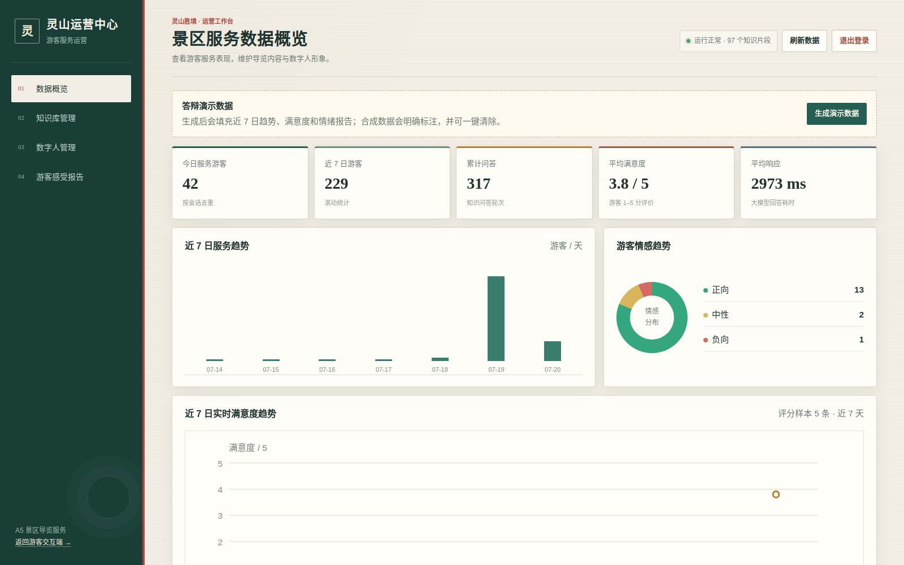
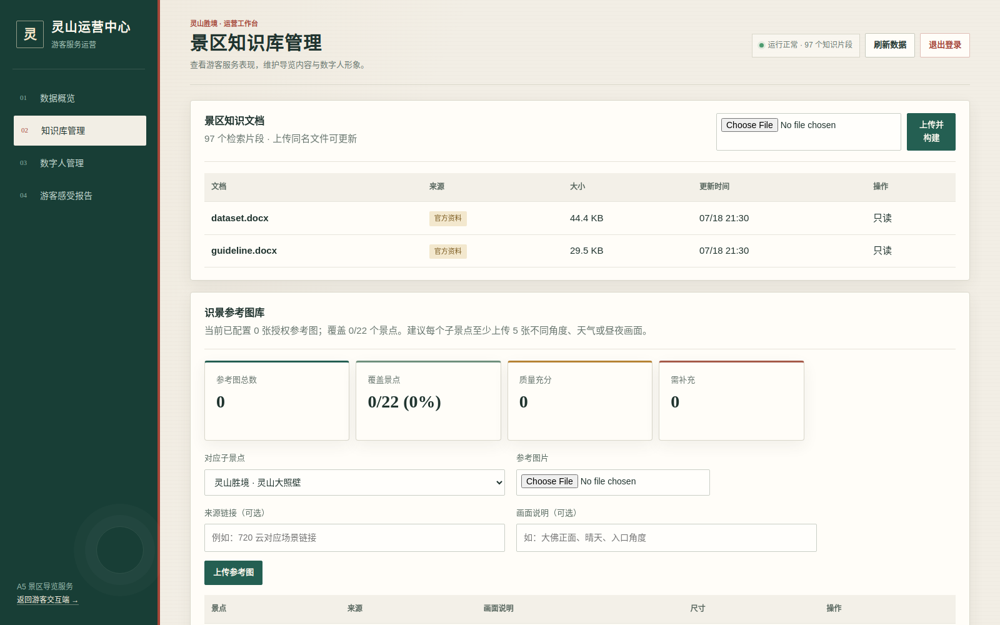
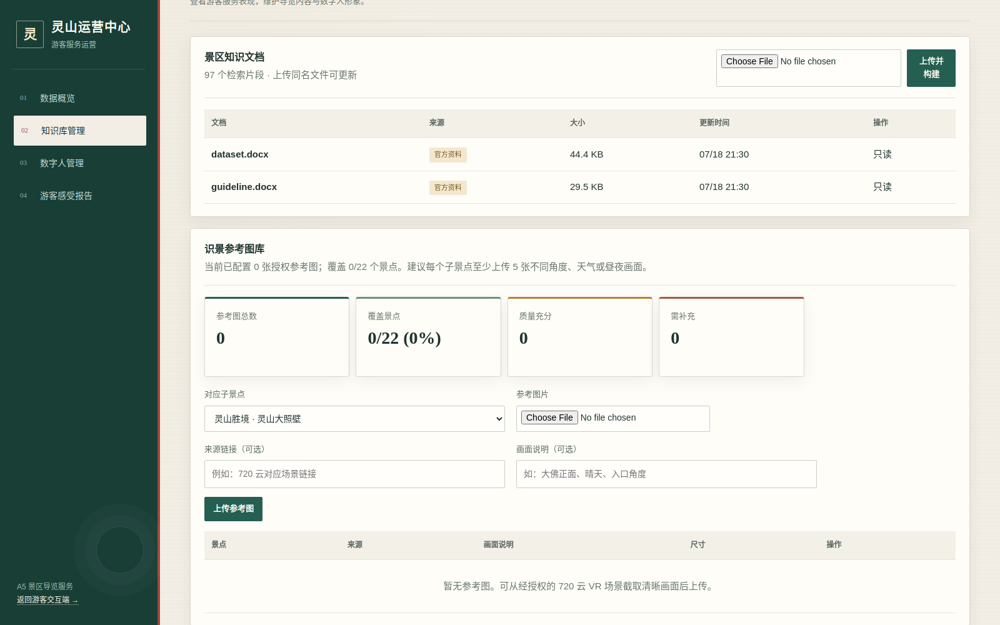
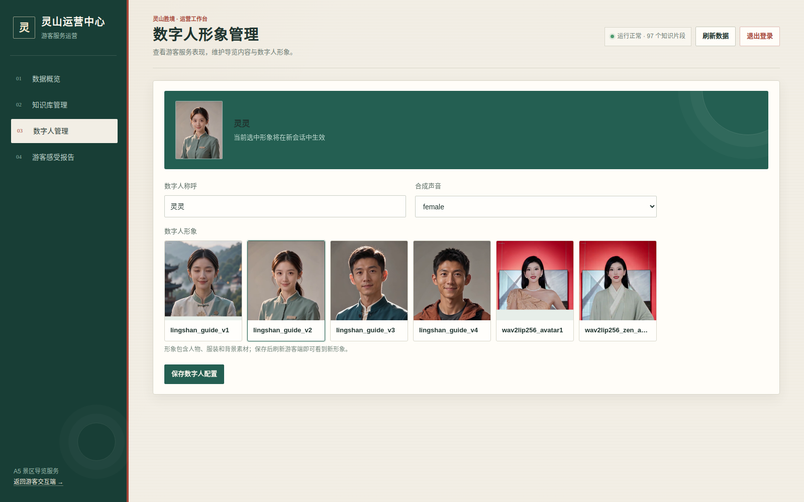
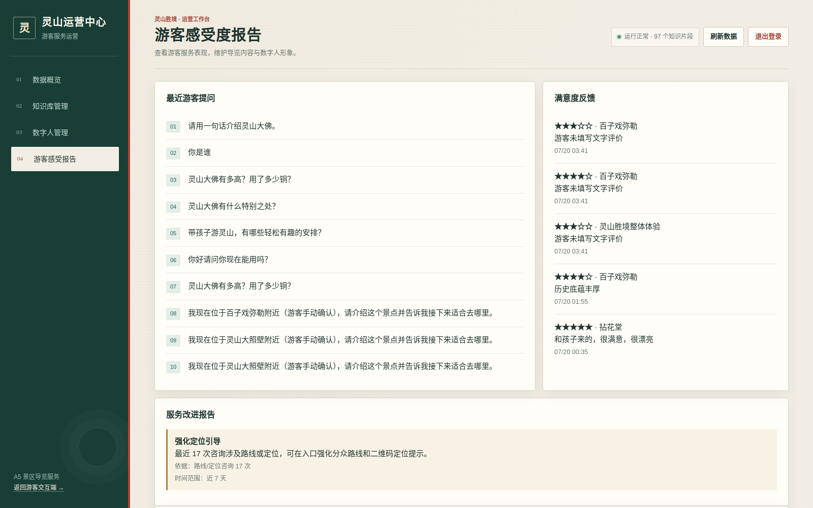
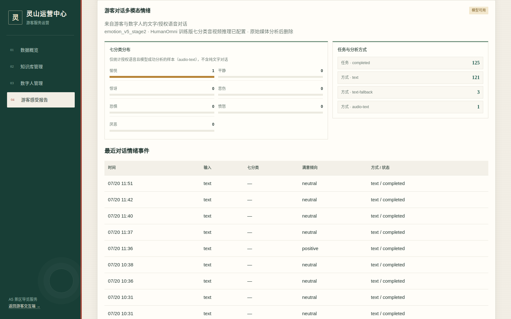
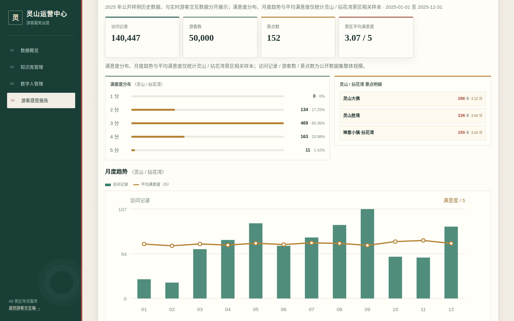

# 灵山小向导·灵曦

## 产品部署与使用说明书

项目：景区导览服务 AI 数字人系统  
赛题组别：A5 景区导览服务 AI 数字人  
更新日期：2026 年 7 月 20 日  


*图 1　游客交互端实际运行界面（数字人已连接）*

## 1. 产品简介

“灵山小向导·灵曦”是一套面向灵山胜境与拈花湾禅意小镇的 AI 数字人导览系统。
游客可通过网页或 Android APK 与数字人进行文字、语音和表情交互，获得景区知识问答、
个性化路线、拍照识景、位置讲解及景点评价服务。景区管理员可通过独立后台维护知识库、
识景参考图库和数字人形象，并查看实时运营指标、游客对话情绪、景点满意度和公开 XLSX
历史游客洞察。

系统的主要技术能力如下：

- 本地 BGE-M3 + FAISS 景区知识库检索，结合云端 GLM、轻量 Qwen3-1.7B 或完整 Qwen2-7B 生成回答。
- ASR 语音识别、TTS 语音合成和 LiveTalking Wav2Lip 实时口型驱动。
- Live2D 情感表情模式作为多模态表达及数字人降级方案。
- GLM 视觉模型初识别 + 本地 SigLIP/CLIP 景区参考图库复核 + 游客确认纠错。
- 手机真实 GPS、景点二维码、区域节点和手动选择相结合的多源定位。
- HumanOmni Stage1 + `emotion_v5_stage2` 七分类语音—文本情绪分析；模型不可用时明确标记文本降级。
- SQLite 实时运营数据与赛题 XLSX 历史数据分层存储、分开展示。

## 2. 使用入口与运行条件

### 2.1 当前演示入口

- 游客交互端：<https://139.159.150.134:20443/>
- 管理员后台：<https://139.159.150.134:20444/admin>，[查看测试账号和密码](#41-登录与安全边界)
- Android APK：<https://139.159.150.134:20443/static/downloads/lingshan-guide-v1.0.2.apk>
- 本机 API 文档：`http://127.0.0.1:8001/docs`

### 2.2 客户端建议

- 桌面端建议使用最新版 Chrome 或 Edge，分辨率不低于 1366×768。
- 手机端可使用 Chrome、系统浏览器或项目 APK。
- 语音功能需要 HTTPS 安全页面和麦克风权限。
- 拍照识景与二维码扫描需要摄像头权限。
- GPS 定位需要系统定位权限；Android APK 已声明精确和粗略定位权限。
- 数字人 WebRTC 播放需要网络可访问公网入口及 TURN 中继。

### 2.3 首次访问

1. 打开游客交互端，等待左侧数字人画面显示并出现“灵曦已准备好”。
2. 浏览器询问麦克风、摄像头或定位权限时，只在使用对应功能时授权。
3. 若使用自签名的内网 HTTPS 地址，首次访问需在浏览器中确认继续访问；当前公网入口使用服务器证书。
4. 页面加载失败时先刷新一次，并检查 `/health` 是否返回 `ok=true`。

## 3. 游客交互端使用方法

### 3.1 数字人与文字问答

游客端左侧为数字人舞台，右侧为功能面板。数字人连接成功后可直接使用。

1. 在“问答”页输入景区问题，例如“灵山大佛有多高？用了多少铜？”。
2. 点击“开始问答”。系统先从景区知识库检索相关资料，再流式生成回答。
3. 页面显示回答文本与知识库依据，同时将完整语义句送入 TTS 和数字人口型服务。
4. 在上一段仍在播报时再次提问，系统会打断旧播报，避免语音重叠。
5. “大佛故事”“两小时路线”“亲子游建议”可用于快速演示。

回答中用于展示路线的 `→`、`>` 等符号会在送入 TTS 前转为停顿或“接着前往”，不会按
“边”逐字朗读。

### 3.2 语音问答与情绪授权

1. 点击“点击说话”，允许浏览器使用麦克风。
2. 正常说出问题，再次点击结束录音；系统自动完成音频格式兼容、ASR 转写和问答。
3. 如需启用七分类多模态情绪分析，展开“更多设置”，勾选情绪分析授权后再录音。
4. 授权后系统把原声、ASR 文本和最近对话上下文异步送入情绪模型，问答本身无需等待情绪任务完成。
5. 原始音频默认在分析后删除；对话文本与情绪标签按部署配置定期清理。

系统不采集游客人脸视频进行情绪判断。管理员也不需要上传音频或视频；管理后台展示的
多模态情绪来自游客与数字人的已授权真实语音对话。

### 3.3 个性化路线

点击“路线”，选择“历史文化”“自然风光”或“亲子家庭”，再点击“为我推荐路线”。
系统结合兴趣、景区知识和当前对话生成路线，并由数字人讲解。


*图 2　个性化路线页面*

### 3.4 拍照识景

1. 点击“识景”，选择“拍照识景”。手机会优先打开后置摄像头，桌面浏览器可选择图片。
2. 系统检查图片类型、大小、清晰度和重复内容。
3. GLM 视觉模型给出景点候选，本地 SigLIP/CLIP 再与管理员维护的参考图库进行相似度复核。
4. 当置信度不足或模型候选冲突时，页面要求游客确认正确景点，不直接生成确定性结论。
5. 游客确认会保存为纠错记录，管理员可据此补充参考图和后续评测集。

识景准确率依赖参考图库覆盖度。管理员应为每个子景点准备至少 5 张不同角度、天气和昼夜
画面，并确保拥有图片使用权。

### 3.5 位置讲解

定位页提供四种使用方式：

- “使用当前位置”：调用手机或浏览器 GPS。
- “摄像头扫码/景点点位码”：适合室内、建筑遮挡和入口标牌。
- “景区 Wi-Fi”：当前为手动区域节点选择，并未读取手机真实 BSSID。
- “手动选择”：不依赖任何权限，始终可用。


*图 3　GPS 与多源降级定位页面*

当前后端配置了 9 个带公开来源的 WGS-84 近似锚点，覆盖灵山大佛、九龙灌浴、祥符禅寺、
灵山梵宫、五印坛城、梵天花海、香月花街、五灯湖和鹿鸣谷。公开点位不是景区现场测绘值，
因此 GPS 命中后只给出候选景点，游客必须确认后才开始讲解。正式部署时应由景区实测坐标替换，
并接入真实 Wi-Fi BSSID、蓝牙信标或景区地图服务。

### 3.6 景点满意度反馈

展开“本次体验反馈”，依次选择景区、子景点和 1–5 分满意度，可填写文字建议后提交。
灵山胜境和拈花湾禅意小镇及其子景点使用统一目录，评分会写入实时数据库，并在管理员后台
的满意度趋势、景点明细和服务建议中使用。


*图 4　更多设置中的情绪授权与景点满意度反馈*

七分类情绪是模型根据对话推断的情感信号；1–5 分满意度是游客主动表达的服务评价。
两者含义不同，系统分开保存、分开展示，不使用 XLSX 的满意度分数训练七分类模型。

### 3.7 数字人呈现模式

“更多设置”中可切换：

- 拟真口型模式：使用 LiveTalking Wav2Lip，根据合成语音实时驱动口型。
- 情感表情模式：使用 Live2D，根据文本/语音情绪映射自然讲解、关怀安慰、积极互动等反应。

## 4. 管理员后台使用方法

### 4.1 登录与安全边界

管理员后台使用独立公网端口。访问管理地址后输入管理员账号和密码，登录成功后获得
HttpOnly、Secure、SameSite 会话 Cookie。未登录用户不能访问管理页面、运营接口、
知识库修改或数字人配置接口。


*图 5　管理员登录页面*

测试账号：admin
密码：admin12345678

完成管理工作后应点击右上角“退出登录”。

### 4.2 数据概览

“数据概览”展示：

- 今日服务游客、近 7 日游客、累计问答、平均满意度和平均响应时间。
- 近 7 日服务趋势、游客情感趋势和实时满意度趋势。
- 热门咨询主题和智能服务建议。



*图 6　实时运营数据概览*

实时指标只来自系统实际产生的对话、情绪任务和游客主动评分。没有样本时显示“暂无”或
“样本不足”，不会用随机数填充。智能服务建议由近 7 天真实数据触发：系统检查负向服务方面、
平均响应是否超过 5 秒、平均评分是否偏低，以及路线/定位咨询量，并同时展示证据与时间范围。

### 4.3 景区知识库管理

“知识库管理”列出官方资料和管理员资料：

- 官方资料为只读，防止误删基础知识。
- 管理员可上传 `.docx`、`.txt` 或 `.md`，同名文件视为更新。
- 上传成功后服务执行文档解析、切片、BGE-M3 向量化和 FAISS 索引重建。
- 新索引构建成功后才替换当前索引；失败时返回明确错误并保留旧索引。
- 管理员上传的文档可删除，删除后自动重建索引。



*图 7　景区知识文档管理与索引状态*

更新知识库后，应在游客端至少测试三个事实问题，并确认回答引用了新文档内容。

### 4.4 识景参考图库

在知识库页面向下滚动可维护识景参考图库：

1. 选择对应子景点。
2. 上传 JPG、PNG 或 WebP 图片。
3. 填写公开来源链接或授权信息，以及画面角度说明。
4. 上传后图片进入本地参考索引，下一次识景即可参与复核。
5. 根据覆盖景点、质量充分、需补充和游客纠错记录持续补齐素材。



*图 8　识景参考图库、覆盖率和纠错质量指标*

### 4.5 数字人管理

“数字人管理”可配置数字人称呼、已安装形象和合成声音。保存后对新会话生效；已有游客
会话不强制中断。服装由所选形象素材确定，表情由对话情绪策略实时驱动，不提供无效文本配置项。



*图 9　数字人形象与声音配置*

这里只能选择服务器已经安装并通过校验的数字人资源。新增人物外观需要先制作头像素材和
口型模型，不能仅靠填写服装文本即时生成新真人形象。

### 4.6 游客感受度报告

“游客感受报告”包含近期问题、主动满意度反馈、服务改进报告、多模态情绪、子景点实时
满意度和公开 XLSX 历史游客洞察。



*图 10　近期游客问题、主动评分与有证据的服务改进建议*

多模态情绪模块展示七类情绪分布、任务状态、分析方式和最近情绪事件：

- 七分类为愉悦、平静、惊讶、悲伤、恐惧、愤怒和厌恶。
- `audio-text` 表示原声与 ASR 文本成功进入多模态模型。
- `text` 表示纯文字对话分析。
- `text-fallback` 表示多模态环境不可用时使用文本降级，不能宣传为真实多模态结果。
- `queued / processing / completed / failed` 表示异步任务状态。

管理员不上传游客媒体。模型状态应以后台显示和 `/v1/admin/emotion/status` 为准；仅看到
模型文件目录存在，不等于七分类推理链路已经可用。



*图 11　游客对话七分类情绪、分析方式与事件状态*

### 4.7 公开 XLSX 历史游客洞察

赛题 XLSX 的 17 列明细会在服务启动时按文件指纹幂等导入 SQLite。当前公开数据集整体
包含 140,447 条访问记录、50,000 名游客和 152 个景点。满意度分布、月度趋势和景区
平均满意度只统计其中 777 条灵山/拈花湾相关记录；“访问记录/游客数/景点数”则明确标为
整个公开数据集规模。



*图 12　灵山/拈花湾满意度分布、景点样本和月度趋势*

实时数据与历史 XLSX 数据分开展示，避免把比赛提供的历史样本伪装成系统实时客流。

## 5. 数据来源与数据流

### 5.1 实时数据

- `chat_logs`：游客问题、数字人回答、引用片段、会话与响应时间。
- `feedback`：游客对景区或子景点提交的 1–5 分和文字建议。
- `emotion_events`：情绪任务、七分类、置信度、倾向、分析方式与失败原因。
- `avatar_settings`：当前数字人配置。
- 识景参考图与纠错记录：管理员授权素材及游客确认结果。

### 5.2 历史数据

- `tourism_visits`：赛题 XLSX 的 17 列游客访问明细。
- `dataset_imports`：源文件指纹、导入时间、行数和存储版本。
- `attractions`：资料包 DOCX 中解析出的灵山胜境、拈花湾及子景点目录。

### 5.3 知识数据

官方资料和管理员上传资料被解析成带来源的知识片段，BGE-M3 生成 1024 维向量，FAISS
执行相似度检索。回答返回引用片段；资料不足时应说明知识库中未找到可靠依据。

## 6. 服务器部署与重启

### 6.1 运行环境

- 当前演示系统暂时部署在一台配备 4 张 NVIDIA RTX 3090 的本地 GPU 服务器上；华为云
  服务器负责公网 HTTPS、管理后台和 WebRTC/TURN 流量转发，不承担模型推理。
- Linux + NVIDIA GPU + CUDA 12.x。
- `ccc` Conda 环境：导览 API、ASR/TTS 调用和 LiveTalking。
- `softcup` Conda 环境：BGE-M3/FAISS、SigLIP/CLIP、HumanOmni 情绪推理。
- 本地模型目录、智谱 API Key、景区资料包和 SQLite 数据目录已配置。

上述“4×RTX 3090 + 华为云转发”是比赛期间的临时演示拓扑，不是软件的固定硬件约束；
服务可按相同接口部署到景区私有服务器或云端 GPU 实例。

### 6.2 启动完整服务

```bash
cd /home/gmn/codes/cup
bash deploy/start_livetalking.sh
bash deploy/start_api.sh
```

`start_api.sh` 会检查并启动 RAG、游客 API、HTTPS/TURN 入口和独立管理端，并按源文件
指纹导入或跳过未变化的 XLSX。两条本地 Qwen 路线都在游客首次选择时，从候选 GPU
中选择满足显存门槛的空闲卡并按需启动，不在系统启动时固定占用某张 GPU；完整 7B 默认
要求 18 GiB 空闲显存，轻量 1.7B 默认要求 6 GiB。

### 6.3 主要端口

- `8001`：游客 HTTP 与公开 API。
- `8443`：游客 HTTPS 与 TURN/TCP。
- `8010`：LiveTalking 内部服务，不直接提供给游客。
- `8020`：RAG 内部服务，仅监听本机。
- `8021`：完整本地 Qwen2-7B OpenAI 兼容服务，按需加载。
- `8022`：轻量本地 Qwen3-1.7B OpenAI 兼容服务，按需加载。
- `8444`：管理员 HTTPS。
- `8011`：公网反向代理使用的本机管理员 HTTP 源站。

### 6.4 重启后验证

```bash
curl -sS http://127.0.0.1:8001/health
curl -sS http://127.0.0.1:8020/health
curl -sS http://127.0.0.1:8001/v1/livetalking/status
curl -sS http://127.0.0.1:8001/v1/location/options
```

随后人工检查：

1. 游客页数字人由“正在准备”变为“已准备好”。
2. 完成一次文字问答并确认存在知识库依据。
3. 完成一次语音录制并确认 ASR、回答、TTS 和口型正常。
4. 在管理员后台确认实时概览、历史 XLSX 和知识片段数已加载。
5. 勾选情绪授权完成一条语音，检查任务是否由 `queued` 进入 `completed` 或明确的 `failed/text-fallback`。

## 7. APK 使用与构建

APK 是原生 Android WebView 外壳，默认打开当前公网游客端。模型、RAG、语音与数字人
均在服务器运行，因此后端和网页功能更新通常无需重新打包 APK。

重新构建时执行：

```bash
cd /home/gmn/codes/cup
bash android/build-apk.sh
```

## 8. 隐私与安全说明

- 语音多模态情绪分析必须由游客主动勾选授权。
- 情绪分析不采集人脸视频；原始语音默认在任务完成或失败后删除。
- 对话文本与情绪标签默认保留 30 天，聚合统计长期保留。
- 系统提供按 `session_id` 导出或删除游客可识别数据的 API。
- 管理员会话使用独立端口、签名 Cookie、来源校验和上传文件校验。
- API Key、管理员密码、会话密钥和 TURN 长期凭据只保存在服务器环境文件中。
- 公开 GPS 坐标保留数据来源并要求游客确认，不标记为景区实测数据。
- 第三方图片必须取得许可后由管理员上传，系统不自动下载受版权保护的 VR 素材。

## 9. 常见问题处理

### 9.1 点击说话后无法录音

- 确认使用 HTTPS 或 localhost。
- 检查浏览器/系统麦克风权限和其他程序是否独占麦克风。
- 若出现 `Unable to decode audio data`，刷新页面后重新录制，并使用最新版 Chrome；当前前端会根据浏览器实际 MIME 类型封装并由后端转码。
- 仍失败时可先使用文字问答，不影响 RAG 和数字人基础演示。

### 9.2 数字人无画面或无声音

- 检查 `/v1/livetalking/status` 是否为 `ready=true`。
- 检查 `deploy/livetalking/service.log` 和浏览器 WebRTC 控制台。
- 确认公网 TURN 可用、浏览器未静音；必要时切换到情感表情模式。

### 9.3 GPS 命中错误景点

- 查看手机报告的精度和候选点距离，不要跳过确认步骤。
- 室内或建筑密集区优先扫描景点二维码。
- 当前公开点位仅为近似值，正式部署应进行现场实测。

### 9.4 识景准确率低

- 检查图片是否过暗、模糊或只包含通用建筑局部。
- 在管理后台查看参考图库覆盖率，为对应子景点补充多角度授权图。
- 要求游客确认候选并记录纠错，再运行固定评测集，不以单张演示图判断整体准确率。

### 9.5 情绪模型显示“文本降级”

- 检查 Stage1 基座、Stage2 LoRA、BERT、训练版 HumanOmni 源码和 `softcup` 环境是否完整。
- 确认训练分支提供 `emotion_probs_from_logits`，并且 `mm_infer` 能返回七分类分数。
- 检查 `EMOTION_GPU` 对应显卡显存和后台任务错误信息。
- 文本降级只保证管理洞察不中断，不等同于多模态模型验证通过。

### 9.6 管理后台数据为空

- 点击“刷新数据”并确认登录会话未过期。
- 检查游客是否实际完成了对话或评分；无样本时显示“暂无”属于正确行为。
- 检查 XLSX 导入状态、源文件路径及 `deploy/api.log`。

## 10. 日志位置

- 导览 API：`deploy/api.log`
- HTTPS API：`deploy/api-ssl.log`
- 管理后台：`deploy/admin-http.log`、`deploy/admin-ssl.log`
- RAG：`deploy/rag.log`
- RAG 看护：`deploy/rag-watchdog.log`
- 本地 Qwen：`deploy/local-llm.log`
- 数字人：`deploy/livetalking/service.log`
- SigLIP/CLIP：`deploy/vision-clip.log`（启用时）
