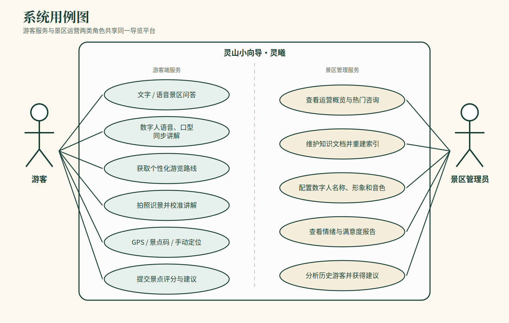
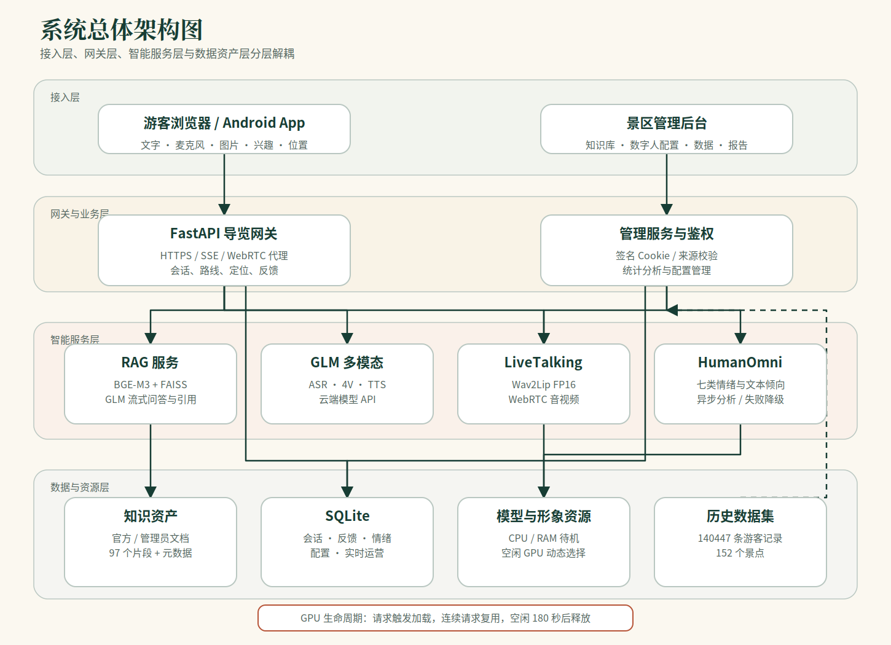
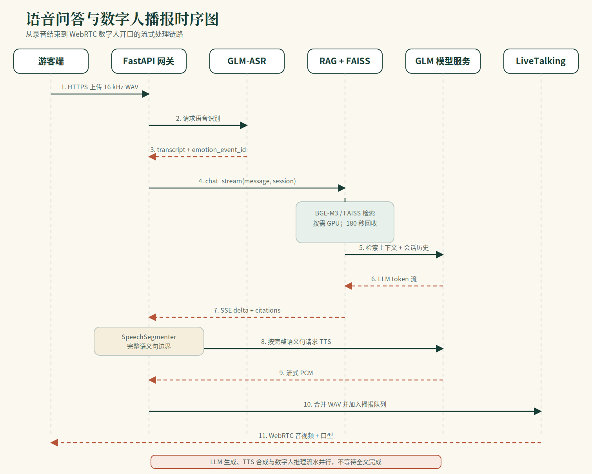
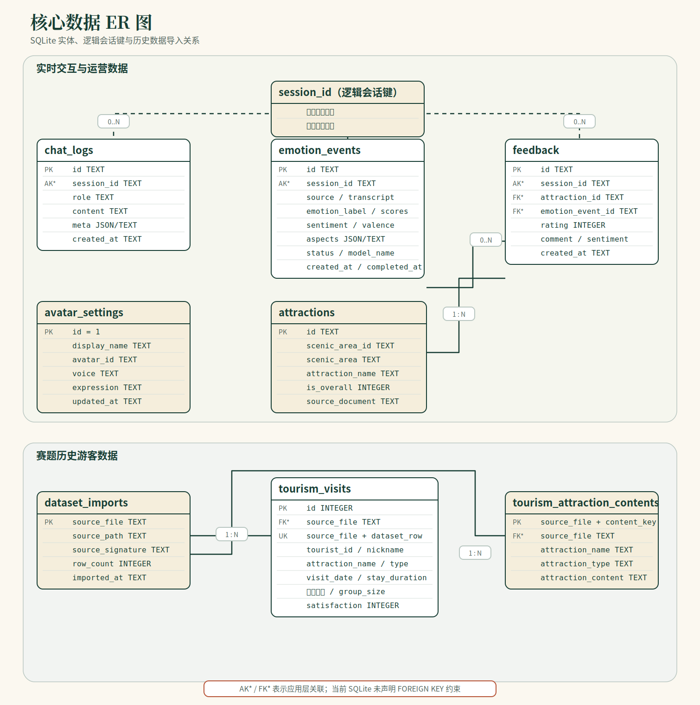

# 灵山小向导·灵曦——软件工程文档

> 项目名称：景区导览服务 AI 数字人系统  
> 文档类型：软件需求与设计说明  
> 文档版本：V1.1  
> 更新日期：2026-07-20

## 1. 文档概述

### 1.1 编写目的

本文档说明“灵山小向导·灵曦”的软件需求、系统架构、核心流程、数据结构、接口、
部署和测试方案，作为开发、联调、测试与后续维护的统一依据。

### 1.2 系统范围

系统包含游客端、景区管理端、导览 API、RAG 服务、语音与视觉模型接口、数字人服务、
情绪分析服务和本地数据存储。系统不负责票务交易、真实地图导航和景区硬件控制。

### 1.3 术语

| 术语 | 说明 |
|---|---|
| RAG | 检索增强生成，先检索景区资料，再生成回答 |
| ASR / TTS | 语音识别 / 语音合成 |
| SSE | 服务端事件，用于流式返回模型文本 |
| WebRTC | 数字人实时音视频传输协议 |
| LiveTalking | 数字人口型驱动与音视频服务 |
| HumanOmni | 音视频情绪分析模型 |

## 2. 系统概述

### 2.1 建设目标

系统为游客提供文字问答、语音问答、数字人讲解、路线推荐、拍照识景、定位辅助和
满意度反馈；为景区管理人员提供知识维护、数字人配置、服务统计和游客感受度分析。

### 2.2 用户角色

| 角色 | 主要职责 |
|---|---|
| 游客 | 提问、听取讲解、查询路线、识别景点、提交反馈 |
| 内容管理员 | 维护景区知识文档并重建索引 |
| 运营管理员 | 查看访问量、热门咨询、响应时间和游客反馈 |
| 系统维护人员 | 启停服务、检查健康状态、管理 GPU 与日志 |

### 2.3 系统边界

- 游客端只能访问公开导览接口，不能直接访问管理接口。
- 管理端使用独立登录会话和来源校验。
- RAG 与 LiveTalking 只作为内部服务，由 FastAPI 网关调用。
- GLM 模型通过服务端 API 调用，密钥不下发到浏览器。
- 知识库回答只以已导入的景区资料为事实依据。

## 3. 需求分析

### 3.1 功能需求

| 编号 | 模块 | 功能要求 |
|---|---|---|
| FR-01 | 景区问答 | 支持文字提问、连续追问、引用来源和资料不足时拒答 |
| FR-02 | 语音交互 | 浏览器录音后完成 ASR，并进入统一问答流程 |
| FR-03 | 数字人讲解 | 将回答按完整语义句合成语音并驱动口型，通过 WebRTC 播放 |
| FR-04 | 路线推荐 | 根据兴趣、时间和当前位置生成游览路线 |
| FR-05 | 拍照识景 | 视觉模型识别图片，再由景区知识库校准讲解 |
| FR-06 | 定位辅助 | 支持 GPS、景点码和手动选择，并在定位失败时降级 |
| FR-07 | 游客反馈 | 对具体景区或景点提交 1–5 分和文字建议 |
| FR-08 | 管理登录 | 管理员登录、会话验证和退出 |
| FR-09 | 知识管理 | 上传、查看、删除管理员文档并触发索引重建 |
| FR-10 | 数字人配置 | 配置显示名称、已安装形象、音色和默认表情 |
| FR-11 | 运营分析 | 展示游客量、问答量、响应时间、热门主题和反馈 |
| FR-12 | 感受度分析 | 保存情绪、文本倾向、方面、置信度和分析状态 |

### 3.2 非功能需求

| 编号 | 类别 | 要求 |
|---|---|---|
| NFR-01 | 性能 | 热链路语音问答目标为 5 秒内开始数字人非静音播报 |
| NFR-02 | 可用性 | RAG、数字人或情绪模型失败时应明确提示或降级，不阻塞基础问答 |
| NFR-03 | 安全 | 管理接口鉴权；模型密钥仅在服务端保存；限制文件类型和大小 |
| NFR-04 | 可维护性 | API、RAG、数字人和分析模块独立部署，提供健康检查 |
| NFR-05 | 资源 | GPU 模型按需启用，空闲后释放 CUDA 上下文 |
| NFR-06 | 可追溯性 | 回答记录引用片段、响应时间、模型路线和会话标识 |

### 3.3 系统用例图



### 3.4 主要用例

| 用例 | 前置条件 | 主流程 | 异常处理 |
|---|---|---|---|
| 景区问答 | 游客端可访问 API | 提交问题→检索知识→流式生成→展示引用 | RAG 不可用时返回明确错误 |
| 语音数字人问答 | HTTPS 麦克风授权成功 | 录音→ASR→RAG→TTS→数字人口型→WebRTC 播放 | 数字人不可用时回退文字或轻量模式 |
| 知识库更新 | 管理员已登录 | 上传文档→校验→切片→向量化→重建索引 | 文件不合法或重建失败时保留旧索引 |
| 运营分析 | 管理员已登录 | 查询日志、反馈、情绪和历史数据→聚合展示 | 数据不足时显示“暂无” |

## 4. 系统设计

### 4.1 总体架构



系统采用分层服务架构。FastAPI 负责对外接口和业务编排；RAG、GLM 多模态、
LiveTalking 和 HumanOmni 作为独立服务；SQLite、FAISS、文档和模型资源分别管理。

### 4.2 模块划分

| 模块 | 代码位置 | 职责 |
|---|---|---|
| 导览 API | `services/api/app/` | 会话、问答、语音、视觉、路线、定位、反馈和管理接口 |
| RAG 服务 | `llm/api.py`、`llm/rag/` | 文档切片、向量检索、提示构建、会话和模型生成 |
| 数字人服务 | `LiveTalking/` | 会话管理、音频队列、口型推理和 WebRTC 输出 |
| 情绪分析 | `services/emotion/` | 音视频情绪推理、文本降级和结构化结果 |
| 管理前端 | `services/api/static/` | 登录、知识管理、数字人设置和数据展示 |
| 部署脚本 | `deploy/` | 服务启动、TLS、TURN 和公网转发 |

### 4.3 语音问答时序



模型回答采用 SSE 流式返回。FastAPI 使用语义边界切分完整句子，并行衔接 TTS 和
LiveTalking，避免等待全文完成。新问题到达时取消旧播报队列，防止音频重叠。

### 4.4 异常与降级

| 故障 | 系统处理 |
|---|---|
| RAG 服务不可用 | 返回 503 和明确错误，不生成无知识依据的答案 |
| LiveTalking 不可用 | 保留文字回答，前端切换轻量数字人或静态状态 |
| ASR 失败 | 提示重新录音，游客仍可使用文字输入 |
| 情绪模型失败 | 记录失败状态并使用文本倾向，不影响问答 |
| GPS 不可用 | 使用景点码或手动选择位置 |
| GPU 不足 | 选择其他空闲卡；无法分配时返回可恢复错误 |

## 5. 数据设计

### 5.1 实体关系



`session_id` 是应用层逻辑会话键；标记为 `AK*`、`FK*` 的字段由应用层维护关联，
当前 SQLite 未声明外键约束。

### 5.2 核心数据表

| 数据表 | 主键 | 用途 |
|---|---|---|
| `chat_logs` | `id` | 保存用户与助手消息、元数据和时间 |
| `feedback` | `id` | 保存景点评分、意见和倾向 |
| `emotion_events` | `id` | 保存情绪任务、结果、模式和错误 |
| `avatar_settings` | 固定 `id=1` | 保存当前数字人配置 |
| `attractions` | `id` | 保存景区与子景点目录 |
| `tourism_visits` | `id` | 保存历史游客访问事实 |
| `dataset_imports` | `source_file` | 保存历史数据导入版本和行数 |

### 5.3 知识库数据

景区文档按标题和段落切片，BGE-M3 生成 1024 维归一化向量，FAISS `IndexFlatIP`
执行相似度检索。每个片段保留来源、标题和片段 ID，回答返回引用信息。管理员文档和
官方资料分开管理，索引重建成功后再替换当前索引。

## 6. 接口设计

### 6.1 公开接口

| 方法 | 路径 | 说明 |
|---|---|---|
| `POST` | `/v1/chat` | 文字问答；支持普通 JSON 或 SSE 流式响应 |
| `POST` | `/v1/asr` | 上传录音并返回识别文本和情绪任务 ID |
| `POST` | `/v1/tts` | 将文本合成为 WAV |
| `POST` | `/v1/vision/guide` | 图片识别并结合 RAG 生成景点讲解 |
| `POST` | `/v1/recommend` | 生成个性化游览路线 |
| `POST` | `/v1/locate` | 解析 GPS、景点码或手动位置 |
| `POST` | `/v1/feedback` | 提交景点评分和建议 |
| `POST` | `/v1/livetalking/offer` | 建立数字人 WebRTC 会话 |
| `POST` | `/v1/livetalking/heartbeat` | 保持数字人会话并检测页面活跃状态 |
| `POST` | `/v1/livetalking/close` | 关闭会话并触发资源释放 |

### 6.2 管理接口

| 方法 | 路径 | 说明 |
|---|---|---|
| `POST` | `/v1/admin/auth/login` | 管理员登录 |
| `POST` | `/v1/admin/auth/logout` | 注销管理会话 |
| `GET/POST/DELETE` | `/v1/admin/kb/documents` | 查看、上传和删除知识文档 |
| `GET/PUT` | `/v1/admin/avatar` | 查询和更新数字人配置 |
| `GET` | `/v1/admin/analytics/overview` | 查询实时运营概览 |
| `GET` | `/v1/admin/analytics/historical` | 查询历史游客分析 |
| `GET` | `/v1/admin/emotion/status` | 查询情绪任务统计 |

### 6.3 流式事件

`/v1/chat` 的 SSE 响应包含 `meta`、`delta`、`done` 和 `error` 事件。`meta` 提供会话、
引用和数字人反应；`delta` 提供增量文本；`done` 提供总延迟；`error` 提供可显示错误。

## 7. 部署设计

### 7.1 服务与端口

| 服务 | 端口 | 暴露范围 |
|---|---:|---|
| 游客 HTTP/API | 8001 | 游客与接口调用方 |
| 游客 HTTPS + TURN/TCP | 8443 | 麦克风与 WebRTC 公网入口 |
| LiveTalking | 8010 | 仅内部 |
| RAG | 8020 | 仅本机 |
| 管理后台 | 8444 | 管理员 |

### 7.2 启动方式

```bash
cd /home/gmn/codes/cup
bash deploy/start_livetalking.sh
bash deploy/start_api.sh
```

### 7.3 GPU 生命周期

- LiveTalking 在页面建立 WebRTC 会话后选择 0–3 号 GPU 中的空闲卡。
- 页面关闭或心跳超时后停止数字人 GPU 进程。
- RAG embedding 使用 CPU 常驻协调器和按需 GPU worker。
- RAG worker 连续请求复用，空闲 180 秒后退出并释放 CUDA 上下文。
- 本地大模型只在选择本地模型路线时加载。

### 7.4 安全要求

- 麦克风访问使用 HTTPS 或 localhost 安全上下文。
- 管理后台使用签名会话 Cookie 和请求来源校验。
- RAG、LiveTalking 与模型密钥不直接暴露给游客端。
- 上传文件校验扩展名、大小和保存路径，禁止路径穿越。
- 多模态原始媒体默认在分析后删除，只保留结构化结果。

## 8. 测试与验收

### 8.1 测试层次

| 层次 | 内容 |
|---|---|
| 单元测试 | 文档切片、向量检索、会话、语义分段、鉴权和数据聚合 |
| 接口测试 | 问答、ASR、TTS、视觉、定位、反馈、管理和数字人接口 |
| 集成测试 | ASR→RAG→TTS→LiveTalking 完整链路 |
| 稳定性测试 | 服务重启、模型失败、页面关闭、心跳超时和 GPU 回收 |
| 安全测试 | 未登录管理访问、非法上传、超大请求和密钥泄露检查 |

### 8.2 验收条件

| 项目 | 条件 |
|---|---|
| 知识问答 | 标准事实题准确率不低于 90%，回答提供知识引用 |
| 语音链路 | 热链路在 5 秒目标内开始非静音数字人播报 |
| 降级能力 | RAG、ASR、数字人或情绪模型失败时有明确反馈 |
| 管理隔离 | 未登录用户不能访问知识、配置和运营管理接口 |
| 资源释放 | 页面无活动或 worker 空闲后，相关 GPU 推理进程退出 |
| 数据真实性 | 无评分或无情绪结果时显示“暂无”，不得生成虚假指标 |

## 9. 维护与约束

### 9.1 当前约束

- 默认问答、语音和视觉依赖 GLM 云端模型，公网波动会影响时延。
- 当前数字人使用已安装头像模型；新增外观需要制作新的模型资源。
- GPS、Wi-Fi 和二维码定位属于适配接口，生产部署需接入真实位置服务。
- 高并发部署需要增加 GPU 配额、会话队列、限流和容量测试。
- 维护时同步更新接口文档并执行知识库回归，定期检查日志、数据导入和服务健康状态。
